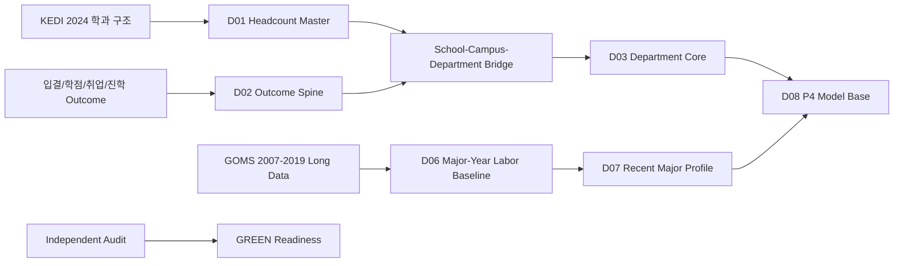

<div align="center">

**Data Engineering**  
[](https://www.python.org/)
[](https://pandas.pydata.org/)
[](https://arrow.apache.org/docs/python/)
[](https://jupyter.org/)

**Quality Gate**  
[](https://github.com/Siegfriex/SBS_DSJA_5th_EDGE/tree/P2_1_3)
[](https://github.com/Siegfriex/SBS_DSJA_5th_EDGE/tree/P2_1_3)
[](https://github.com/Siegfriex/SBS_DSJA_5th_EDGE/tree/P2_1_3)
[](https://github.com/Siegfriex/SBS_DSJA_5th_EDGE/tree/P2_1_3)

**Portfolio Branch**  
[](https://github.com/Siegfriex/SBS_DSJA_5th_EDGE/tree/P2_1_3)
[](https://github.com/Siegfriex/SBS_DSJA_5th_EDGE)

# SBS DSJA 5th EDGE

**P2-G3 University Department Modeling Base**  
2024년 대학-학과 단위 입결·학점·취업·진학·구조자료·GOMS context를 하나의 model-ready mart로 통합한 데이터 엔지니어링 포트폴리오

[프로젝트 보기](https://github.com/Siegfriex/SBS_DSJA_5th_EDGE/tree/P2_1_3) · [방법론](https://github.com/Siegfriex/SBS_DSJA_5th_EDGE/blob/P2_1_3/docs/METHODOLOGY.md) · [데이터 카드](https://github.com/Siegfriex/SBS_DSJA_5th_EDGE/blob/P2_1_3/docs/DATA_CARD.md) · [감사 요약](https://github.com/Siegfriex/SBS_DSJA_5th_EDGE/blob/P2_1_3/docs/AUDIT_SUMMARY.md)

</div>

---

## 소개

이 저장소는 SBS 데이터저널리즘/데이터사이언스 과정의 P2-G3 산출물을 GitHub 포트폴리오 형태로 정리한 레포입니다.  
목표는 대학 순위표를 만드는 것이 아니라, **대학-학과 단위**의 2024년 분석 spine을 만들고 이후 P4 모델링에서 사용할 수 있도록 검증 가능한 데이터 mart를 구축하는 것입니다.

`main` 브랜치는 랜딩 README만 유지합니다. 실제 포트폴리오 산출물은 [`P2_1_3`](https://github.com/Siegfriex/SBS_DSJA_5th_EDGE/tree/P2_1_3) 브랜치에 있습니다.

---

## 주요 성과

| 항목 | 결과 |
|---|---:|
| 최종 판정 | **GREEN** |
| Critical failure | **0** |
| 최종 mart `D08` | **10,242 x 151** |
| 구조 master `D01` | **34,969 x 186** |
| D01 grain duplicate | **0** |
| 구조 고신뢰 매칭률 | **83.59%** |
| `major_group_7` 매핑률 | **98.60%** |
| D07 → D08 lineage mismatch | **0** |
| Split leakage | **0** |
| Manifest hash mismatch | **0** |

---

## 파이프라인



---

## 핵심 기능

| 기능 | 설명 |
|---|---|
| **학과 단위 spine 고정** | 2024년 outcome row `10,242`개를 삭제하지 않고 최종 mart까지 보존 |
| **구조자료 bridge** | 학교명·캠퍼스·학과명 alias를 분리하고 다중 후보/캠퍼스 충돌은 자동확정 금지 |
| **계열 표준화** | `HUM/SOC/EDU/ENG/NAT/MED/ART` 7계열로 mapping하고 ambiguous/unknown은 sample mask로 분리 |
| **GOMS context 결합** | 2007-2019 전공계열별 노동시장 지표를 D06/D07로 재계산 후 D08에 lineage 보존 |
| **감사 패키지** | shape, key duplicate, split leakage, manifest hash, sample registry를 독립 재검산 |
| **GitHub 공개 패키징** | raw CSV/parquet/notebook은 제외하고 QA 요약·샘플·문서 중심으로 공개 |

---

## 브랜치 구조

| 브랜치 | 용도 |
|---|---|
| `main` | README-only 랜딩 페이지 |
| `P2_1_3` | P2-G3 포트폴리오 문서, QA 요약 CSV, 샘플, 검증 스크립트 |

---

## P2_1_3 구성

```text
.
├── README.md
├── docs/
│   ├── PROJECT_BRIEF.md
│   ├── METHODOLOGY.md
│   ├── DATA_CARD.md
│   ├── AUDIT_SUMMARY.md
│   └── GITHUB_RELEASE_CHECKLIST.md
├── data/
│   ├── portfolio_metrics.json
│   ├── local1_independent_qa.csv
│   ├── local2_independent_qa.csv
│   ├── manifest_hash_check.csv
│   ├── sample_registry_recalculation.csv
│   └── d08_sample_50_seed3085.csv
└── src/
    └── verify_portfolio_snapshot.py
```

---

## 검증 방법

`P2_1_3` 브랜치에서 아래 명령으로 포트폴리오 스냅샷의 핵심 QA를 다시 확인할 수 있습니다.

```bash
python src/verify_portfolio_snapshot.py
```

검증 항목:

- final verdict가 `GREEN`인지
- critical failure가 0인지
- Local 1/2 QA가 전부 PASS인지
- manifest hash check가 전부 PASS인지
- sample registry 재계산이 registry 값과 일치하는지
- D08 행수가 10,242인지

---

## 데이터 공개 정책

원본 CSV, 전체 parquet mart, notebook 실행 dump는 공개 저장소에 올리지 않습니다.  
대신 감사 가능한 요약 CSV, 샘플 50행, hash/shape inventory, 방법론 문서를 제공합니다.

---

<div align="center">

**SBS DSJA 5th EDGE** — P2-G3 Data Engineering Portfolio

</div>
