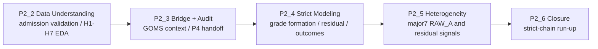

**University Grade Signal Research Portfolio** 

# SBS DSJA 5th EDGE — P2 Grade Signal Portfolio

**같은 A학점은 정말 같은 의미인가?** 
2024년 대학-학과 단위 성적분포를 입결, 학교/전공구조, 노동시장 context, 취업성과, 대학원 진학성과와 연결해 검증한 엔지니어링 리서치 포트폴리오

---

## Repository Policy

`main`은 포트폴리오 랜딩 README만 유지한다. 실제 연구 산출물은 단계별 브랜치에 분리했다.

| Branch | Role | Representative Notebook |
|---|---|---|
| [`P2_1_3`](https://github.com/Siegfriex/SBS_DSJA_5th_EDGE/tree/P2_1_3) | Earlier P2-G3/G4 public package, audit summary, data card, research specification | [`docs/P2_G4_RESEARCH_SPEC.md`](https://github.com/Siegfriex/SBS_DSJA_5th_EDGE/blob/P2_1_3/docs/P2_G4_RESEARCH_SPEC.md) |
| [`P2_2`](https://github.com/Siegfriex/SBS_DSJA_5th_EDGE/tree/P2_2) | Data understanding, admission validation, H1-H7 article-style EDA | [`h1_h7_intelligence_briefing.ipynb`](https://github.com/Siegfriex/SBS_DSJA_5th_EDGE/blob/P2_2/workbook/p2/p2_2/h1_h7_intelligence_briefing.ipynb) |
| [`P2_3`](https://github.com/Siegfriex/SBS_DSJA_5th_EDGE/tree/P2_3) | GOMS bridge, independent audit, P4 handoff candidate | [`p3_1.ipynb`](https://github.com/Siegfriex/SBS_DSJA_5th_EDGE/blob/P2_3/workbook/p2/p2_3/p3_1.ipynb) |
| [`P2_4`](https://github.com/Siegfriex/SBS_DSJA_5th_EDGE/tree/P2_4) | Strict grade formation, model readiness, residual/outcome chain | [`p2_grade_formation_strict.ipynb`](https://github.com/Siegfriex/SBS_DSJA_5th_EDGE/blob/P2_4/workbook/p2/p2_4/p2_grade_formation_v1_strict/p2_grade_formation_strict.ipynb) |
| [`P2_5`](https://github.com/Siegfriex/SBS_DSJA_5th_EDGE/tree/P2_5) | Major7 heterogeneity modeling and visual A2 summary | [`P2_G5_A2.ipynb`](https://github.com/Siegfriex/SBS_DSJA_5th_EDGE/blob/P2_5/workbook/p2/p2_5/P2_G5_A2.ipynb) |
| [`P2_6`](https://github.com/Siegfriex/SBS_DSJA_5th_EDGE/tree/P2_6) | Final strict-chain run-up and confirmatory closure | [`P2_G6_1.ipynb`](https://github.com/Siegfriex/SBS_DSJA_5th_EDGE/blob/P2_6/workbook/p2/P2_6/P2_G6_1.ipynb) |

---

## Research Question

> **대학별·학과별 A비율 차이는 단순한 학점 관대성인가, 아니면 입학생 구성·전공구조·평가환경을 반영하는 신호인가? 그리고 이 신호는 취업시장과 대학원 진학시장에서 다르게 읽히는가?**

이 프로젝트는 대학 순위표를 만드는 작업이 아니다. 분석 단위는 `2024년 x 학교 x 캠퍼스 x 학과/전공`이며, 결과는 개인 GPA가 아니라 집단 수준의 조건부 연관성으로 해석한다.

---

## Engineering Research Flow

The core engineering principle is **contract-first modeling**:

1. Validate source and measurement assumptions before modeling.
2. Freeze handoff manifests and lineage hashes before downstream use.
3. Keep blocked branches blocked until the feature contract is approved.
4. Separate development fit, cross-validation, and locked-test interpretation.
5. Treat coefficients and AME values as conditional associations, not causal effects.

---

## Branch Details

### P2_2 — Data Understanding and H1-H7 EDA

Purpose: establish the evidence base before modeling. 
Representative notebook: [`h1_h7_intelligence_briefing.ipynb`](https://github.com/Siegfriex/SBS_DSJA_5th_EDGE/blob/P2_2/workbook/p2/p2_2/h1_h7_intelligence_briefing.ipynb)

Includes:

- grade distribution and admission-selectivity EDA
- cached admission crawl validation
- H1-H7 article-style briefing
- major-level integrated sample and missingness semantics
- validation outputs and figures

### P2_3 — GOMS Bridge and Independent Audit

Purpose: connect grade-signal data with labor-market context and produce a downstream handoff. 
Representative notebook: [`p3_1.ipynb`](https://github.com/Siegfriex/SBS_DSJA_5th_EDGE/blob/P2_3/workbook/p2/p2_3/p3_1.ipynb)

Includes:

- independent P2-G3 audit report
- GOMS major-profile artifacts
- local1/local2 manifests
- P4 candidate handoff lock
- bridge QA and mapping evidence

### P2_4 — Strict Grade-Formation Modeling

Purpose: model A-rate formation under strict-clean contracts and produce residual/outcome branches. 
Representative notebook: [`p2_grade_formation_strict.ipynb`](https://github.com/Siegfriex/SBS_DSJA_5th_EDGE/blob/P2_4/workbook/p2/p2_4/p2_grade_formation_v1_strict/p2_grade_formation_strict.ipynb)

Includes:

- P2-S nested OLS and locked-test reporting
- GAM nonlinearity checks
- MixedLM variance decomposition
- P3 residual artifacts
- P4 strict outcome-modeling artifacts
- model-readiness and preprocessing-integrity reports

### P2_5 — Major7 Heterogeneity

Purpose: test whether the A-rate signal behaves differently by major group and outcome. 
Representative notebook: [`P2_G5_A2.ipynb`](https://github.com/Siegfriex/SBS_DSJA_5th_EDGE/blob/P2_5/workbook/p2/p2_5/P2_G5_A2.ipynb)

Includes:

- strict major7 AME estimates
- RAW_A and residual branch separation
- P5 V1-vs-strict sensitivity audit
- A2 visual insight notebook, figures, and report
- context profile limitations with seven major groups

### P2_6 — Final Strict-Chain Run-up

Purpose: close the research chain and make the final cross-branch interpretation auditable. 
Representative notebook: [`P2_G6_1.ipynb`](https://github.com/Siegfriex/SBS_DSJA_5th_EDGE/blob/P2_6/workbook/p2/P2_6/P2_G6_1.ipynb)

Includes:

- final strict-chain run-up report
- confirmatory closure notebook
- QA and manifest evidence
- final figures and decision matrices

---

## Current Published Branches

| Branch | Folder Scope | Status |
|---|---|---|
| `P2_2` | `workbook/p2/p2_2/` | published |
| `P2_3` | `workbook/p2/p2_3/` | published |
| `P2_4` | `workbook/p2/p2_4/` | published |
| `P2_5` | `workbook/p2/p2_5/` | published |
| `P2_6` | `workbook/p2/P2_6/` | published |

---

## Interpretation Guardrails

- Do not treat A-rate coefficients as causal effects.
- Do not merge P2-S and P2-Q conclusions when P2-Q is feature-contract blocked.
- Do not interpret major7 context profiles as confirmatory meta-regression with only seven groups.
- Do not compare development R2 and locked-test metrics as the same evidence.
- Use branch manifests and README files to verify which upstream artifacts each stage reads.

---

**P2 Grade Signal Portfolio** — Data engineering, measurement validation, statistical modeling, and visual research packaging

