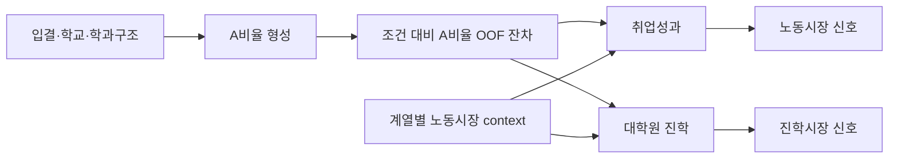

<div align="center">

**Data Pipeline**  
[](https://www.python.org/)
[](https://pandas.pydata.org/)
[](https://parquet.apache.org/)
[](https://jupyter.org/)

**Modeling Plan**  
[](docs/P2_G4_RESEARCH_SPEC.md)
[](docs/P2_G4_RESEARCH_SPEC.md)
[](docs/P2_G4_RESEARCH_SPEC.md)
[](docs/P2_G4_RESEARCH_SPEC.md)

**Quality Gate**  
[](docs/AUDIT_SUMMARY.md)
[](docs/DATA_CARD.md)
[](data/cross_agent_handoff_audit.csv)
[](data/split_leakage_check.csv)

# P2-G3/G4 University Grade Signal Project

**같은 A학점은 정말 같은 의미인가?**  
2024년 대학-학과 단위 성적분포를 입결·전공구조·학교구조·노동시장 context와 결합하고, P2-G4에서 노동시장과 진학시장이 학점을 서로 다른 신호로 읽는지 검증하는 데이터저널리즘 프로젝트

[연구명세](docs/P2_G4_RESEARCH_SPEC.md) · [방법론](docs/METHODOLOGY.md) · [데이터 카드](docs/DATA_CARD.md) · [감사 요약](docs/AUDIT_SUMMARY.md) · [검증 스크립트](src/verify_portfolio_snapshot.py)

</div>

---

## 핵심 질문

> **대학별·학과별 A비율 차이는 단순한 학점 관대성인가, 아니면 입학생 구성·전공구조·평가환경을 반영하는 신호인가? 그리고 이 신호는 취업시장과 대학원 진학시장에서 다르게 읽히는가?**

본 프로젝트는 대학 순위를 만들지 않는다. 한 행의 단위는 `2024년 x 학교 x 캠퍼스 x 학과`이며, 결과는 개인 GPA가 아니라 집단 수준의 조건부 연관성으로 해석한다.

---

## 현재 완성된 것: P2-G3 Handoff

| 항목 | 결과 |
|---|---:|
| 독립감사 판정 | **GREEN** |
| critical failure | **0** |
| 최종 mart `D08` | **10,242 x 151** |
| 구조 master `D01` | **34,969 x 186** |
| D01 grain duplicate | **0** |
| 구조 고신뢰 매칭률 | **83.59%** |
| `major_group_7` 매핑률 | **98.60%** |
| split leakage | **0** |
| manifest hash mismatch | **0** |

---

## 다음 분석: P2-G4 CRISP-DM

| CRISP-DM 단계 | 이번 프로젝트에서의 의미 | 산출물 |
|---|---|---|
| Business Understanding | “같은 A학점은 같은 의미인가?”를 기사 질문으로 정식화 | RQ/Hypothesis/Gate |
| Data Understanding | P2-G3 GREEN handoff의 grain, target, missingness, leakage 확인 | data card, sample registry |
| Data Preparation | target별 model matrix, GroupKFold, OOF residual 생성 | grade/employment/progression matrix |
| Modeling | OLS, MixedLM, school FE, GAM, ML benchmark | effect size, ICC, block increment |
| Evaluation | 취업 vs 진학에서 A비율/OOF 잔차의 추가 설명력 비교 | hypothesis verdict table |
| Deployment | 기사·보고서·재현 가능한 분석자산으로 배포 | visuals, report, audit bundle |

자세한 연구 설계는 [`docs/P2_G4_RESEARCH_SPEC.md`](docs/P2_G4_RESEARCH_SPEC.md)에 압축 정리했다.

---

## Modeling Roadmap



핵심 비교는 예측 정확도 자체가 아니라, 같은 조건에서 `A비율` 또는 `조건 대비 A비율 잔차`가 취업성과와 대학원 진학성과에 제공하는 **증분 설명력**이다.

---

## Repository Map

| 경로 | 설명 |
|---|---|
| `docs/P2_G4_RESEARCH_SPEC.md` | 간추린 P2-G4 CRISP-DM 연구명세 |
| `docs/PROJECT_BRIEF.md` | 문제정의와 프로젝트 해석 |
| `docs/METHODOLOGY.md` | P2-G3 handoff와 P2-G4 모델링 방법론 |
| `docs/DATA_CARD.md` | 데이터 grain, target, sample registry, 한계 |
| `docs/AUDIT_SUMMARY.md` | 독립감사 GREEN 근거 |
| `data/*.csv` | QA, sample, hash, lineage 요약 |
| `src/verify_portfolio_snapshot.py` | 공개 스냅샷 자체 검증 |

---

## 검증

```bash
python src/verify_portfolio_snapshot.py
```

이 명령은 final verdict, critical failure, Local 1/2 QA, manifest hash, sample registry, D08 row count를 확인한다.

---

## 공개 정책

원본 CSV, 전체 parquet mart, notebook 실행 dump는 공개 저장소에 올리지 않는다. 공개 브랜치에는 QA 요약, 샘플 50행, hash/shape inventory, 연구명세와 방법론만 포함한다.

---

<div align="center">

**P2-G3/G4** — University Grade Signal, Labor Market, and Progression Pathways

</div>
